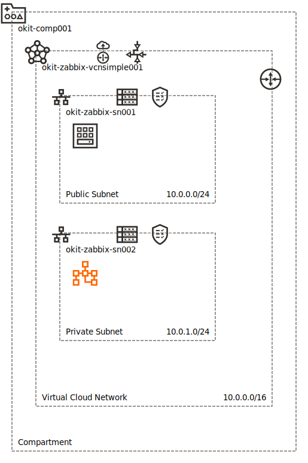
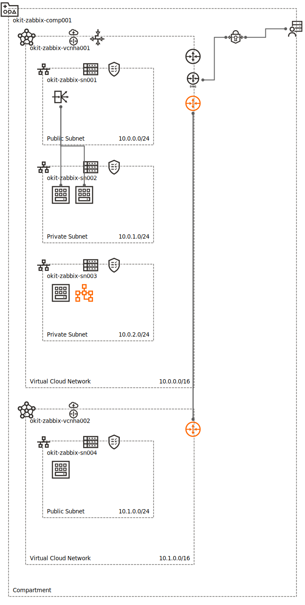

## Deploy Zabbix on Oracle Cloud Infrastructure (OCI) with MySQL Database Service... as code!!!

## Introduction

In this page you will find information and code example to deploy, using Terraform, Zabbix on Oracle Cloud Infrastructure with MySQL Database Service as database for Zabbix. 
The deployment, since we will be using terraform, will be performed via code. Inspecting the code which it is provided, you will be able to udnerstand how easy it is to turn your OCI infrastructure into reusable code!

Prior to proceeding, it is suggested to have some knowledge about OCI, about the terraform provider for OCI, and that you get an OCI trial account activated (if needed).
Here you can find some useful links to enhance your knowledge:
- **[OCI Level 100 Course - YouTube playlist](https://www.youtube.com/watch?v=BwANK1xJql8&list=PLgvLoiAxJHJ1IPdOvjUWxsU1BvFSXtGvB)**
- **[Terraform provider for OCI Documentation](https://registry.terraform.io/providers/hashicorp/oci/latest/docs)**

## Before you begin:
- Activate an OCI Trial Account, using the instructions at the following link:
**[Subscribe to OCI Trial Account](https://docs.oracle.com/en-us/iaas/Content/GSG/Tasks/signingup_topic-Sign_Up_for_Free_Oracle_Cloud_Promotion.htm)**

- Install the terraform provider for OCI, using the following documentation:
**[Install Terraform Provider for OCI](https://docs.oracle.com/en-us/iaas/Content/API/SDKDocs/terraforminstallation.htm)**

## Overview of deployment architectures

I have developed the following architectures

## Simple Architecture:
Using this code, which I highly suggest to review and understand, you will be able to deploy Zabbix Server and Frontend on a single Linux Compute Instance, into a public subnet. This architecture uses MySQL Database Service as data store, located in a private subnet.

Terraform will perform the following operations:
- Deploy VCN with Internet access, Public Subnet, Private Subnet, and all the needed Security List Rules
- Deploy MySQL Database Service single instance
- Deploy Linux Compute Instance in the public Subnet
- Install Zabbix on the Compute Instance, Deploy the Zabbix Database, Configure the Server and the Frontend

Architecture Diagram:

**[Download Simple Architecture terraform code](./code/Zabbix_OCI_MDS_SimpleArch.zip)** 
**PLEASE NOTE: prior continuing with the deployment, mind the README!**

## Extended Architecture:
Using this code, which I highly suggest to review and understand, you will be able to deploy Zabbix Server and Frontend in separate Compute Instances, with Frontend High Availability. Additionally you will deploy Zabbix Proxy on a separate VCN. MySQL Database Service with High Availability it is used as database for the Server and for the Frontend.

Terraform will perform the following operations:
- Deploy one VCN with Internet access (for Zabbix Server and Frontend), Public Subnet, two Private Subnets, and all the needed Security List Rules.
- Deploy a second VCN with Internet access (for Zabbix Proxy), Public Subnet and all the needed Security List Rules.
- Deploying and configuring VCN local peering with DNS recognition between VCN 1 and VCN 2.
- Deploying on OCI side the configuration needed for IPSEC VPN to connect an on-prem environment. Configuration operated with place holder values.
- Deploy MySQL Database Service on private subnet in high-availability which will serve both Server and Proxy.
- Deploy a Load Balancer for Frontend HA on Public Subnet in VCN 1
- Deploy 2 Compute Instances on one private subnet, installing and configuring Zabbix Frontend
- Deploy a Compute Instance on the second private subnet, installing and configuring Zabbix Server.
- Deploy a Compute Instance on Public Subnet in VCN 2. Installing and Configuring Zabbix Proxy.

Architecture Diagram:

**[Download Extended Architecture terraform code](./code/Zabbix_OCI_MDS_ExtendedArch.zip)** 
**PLEASE NOTE: prior continuing with the deployment, mind the README!**
